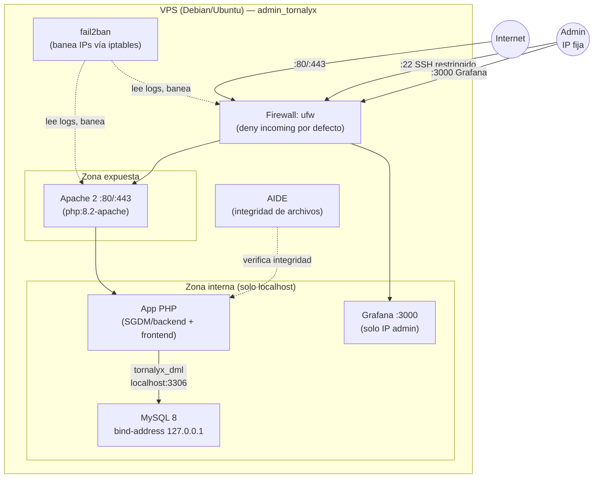

# Esquema de red — Tornalyx (Entrega 2)

Arquitectura de red objetivo para el despliegue en un VPS real (no aplica
al hosting actual en Render, que es PaaS sin acceso a la capa de red/SO —
ver `SGDM/backend/database/dcl.sql`, que ya documenta esta misma distinción
para los usuarios de base de datos).

## Diagrama



## Puertos y reglas

| Puerto | Servicio | Origen permitido | Justificación |
|--------|----------|-------------------|----------------|
| 22/tcp | SSH | Solo IP fija del admin | Reduce superficie de ataque; `fail2ban` banea igual si se filtra la IP. |
| 80/tcp | HTTP | Cualquiera | Redirige a HTTPS con un 301 (la primera regla de `SGDM/frontend/.htaccess`), así ninguna petición queda en claro. El HSTS por sí solo no alcanzaba: recién protege desde la segunda visita. |
| 443/tcp | HTTPS (Apache) | Cualquiera | Tráfico de la aplicación, con los headers de `SGDM/frontend/.htaccess` (CSP, HSTS, X-Frame-Options). |
| 3306/tcp | MySQL | Nadie desde afuera (`bind-address 127.0.0.1`) | La app y MySQL corren en el mismo host; no hay razón para exponer el puerto de base de datos a la red. Es el valor por defecto en Debian/Ubuntu, pero no lo fija ningún script del repo: confirmarlo en el servidor (ver Verificación). |
| 3000/tcp | Grafana | Solo IP fija del admin | Panel de monitoreo, no es de uso público. |

## Segmentación

- **Zona expuesta (borde):** solo Apache recibe tráfico de Internet.
- **Zona interna:** MySQL y Grafana nunca reciben conexiones directas desde
  Internet, solo desde `localhost` (MySQL) o desde la IP del admin
  (Grafana), reforzado por las reglas de `scripts/servidor/firewall-ufw.sh`.
- **Defensa en profundidad:** el firewall es la primera barrera; `fail2ban`
  actúa como segunda barrera baneando IPs con intentos fallidos repetidos
  (SSH y login de Apache); AIDE detecta si un atacante que sí entró modificó
  archivos del sistema o de la aplicación. Detalle de cada pieza en
  `docs/entrega2/seguridad-servidor.md`.

## Verificación

Cada afirmación de este documento se puede comprobar en el servidor:

```bash
# El firewall está activo y solo con las reglas previstas
sudo ufw status verbose

# MySQL escucha solo en loopback, no en 0.0.0.0
sudo ss -lntp | grep 3306

# El puerto 80 redirige a HTTPS
curl -sI http://tornalyx.example/torneos | head -1   # espera 301

# ...y NO redirige detrás del proxy que termina TLS (si no, sería un bucle)
curl -sI -H 'X-Forwarded-Proto: https' http://127.0.0.1/torneos | head -1   # espera 200

# fail2ban corriendo, con sus jails cargadas
sudo fail2ban-client status
```

El redirect y las cabeceras se probaron contra un Apache 2.4.58 real en los
cinco escenarios que importan: petición en claro, detrás de proxy TLS,
`localhost` de desarrollo, health check de la raíz y acceso a archivos
sensibles (`.htaccess`, `.sql`).
