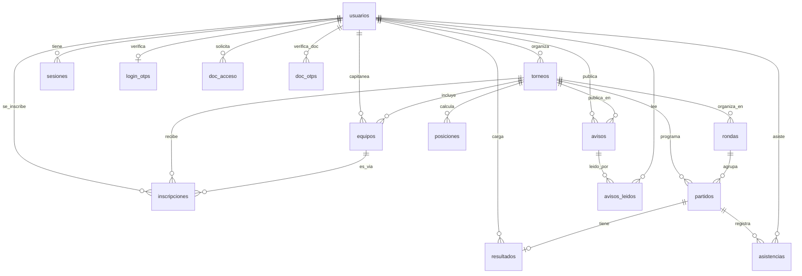

# Modelo relacional — Tornalyx (Entrega 2)

Esquema completo en `SGDM/backend/database/migrations/schema.sql` (15 tablas).
Este documento resume las relaciones y justifica la normalización.

## Diagrama entidad-relación

## Justificación de normalización

- **1FN (atomicidad):** todas las columnas guardan un único valor escalar
  (ej.: `usuarios.email`, `torneos.fecha_inicio`); no hay columnas con listas
  o valores compuestos serializados.
- **2FN (sin dependencias parciales):** todas las tablas con clave primaria
  simple (`id INT UNSIGNED AUTO_INCREMENT`) no tienen el problema de
  dependencia parcial por definición. Las tablas con clave primaria
  compuesta son puras tablas de unión N:M sin columnas adicionales que
  dependan solo de una mitad de la clave:
  - `asistencias` — PK `(partido_id, usuario_id)`, sin columnas propias más
    allá de la marca de asistencia.
  - `avisos_leidos` — PK `(aviso_id, usuario_id)`, solo registra el hecho de
    lectura.
  - `doc_otps` — PK `(usuario_id, materia)`, el código OTP depende de ambas
    columnas a la vez (un código por usuario+materia), no de una sola.
- **3FN (sin dependencias transitivas):** no hay columnas que dependan de
  otra columna no clave. Ejemplo: `posiciones` guarda `puntos`, `pj`, `pg`,
  etc. directamente ligados a `(torneo_id, contendiente_id, tipo)` — no se
  derivan de otra columna no-clave de la misma tabla, se recalculan desde
  `resultados` por el motor de torneos (`SGDM/backend/shared/Fixture.php`).
  `usuarios.rol` y `usuarios.estado` son atributos propios del usuario, no
  dependen de ninguna otra columna de `usuarios`.
- **Integridad referencial:** las 15 tablas declaran sus `FOREIGN KEY`
  explícitas (ver `schema.sql`), con `ON DELETE CASCADE` para datos que no
  tienen sentido sin su padre (ej.: `partidos` sin su `torneo`) y
  `ON DELETE RESTRICT`/`SET NULL` donde borrar el padre no debe borrar
  silenciosamente el hijo (ej.: no se puede borrar un `usuario` que sea
  `organizador_id` de un torneo activo).
