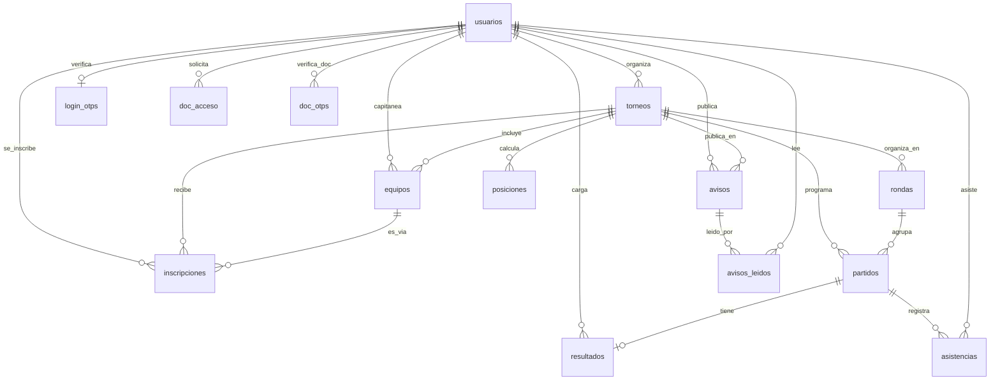

# Modelo relacional — Tornalyx (Entrega 2)

Esquema completo en `SGDM/backend/database/migrations/schema.sql`: 14 tablas de
negocio (las del diagrama de abajo) más `schema_migrations`, que no modela nada
del dominio y solo registra qué migraciones se aplicaron a esa base.
Este documento resume las relaciones y justifica la normalización.

## Diagrama entidad-relación

## Justificación de normalización

- **1FN (atomicidad):** todas las columnas guardan un único valor escalar
  (ej.: `usuarios.email`, `torneos.fecha_inicio`); no hay columnas con listas
  o valores compuestos serializados.
- **2FN (sin dependencias parciales):** todas las tablas con clave primaria
  simple (`id INT UNSIGNED AUTO_INCREMENT`) no tienen el problema de
  dependencia parcial por definición. Las tablas con clave primaria
  compuesta son puras tablas de unión N:M sin columnas adicionales que
  dependan solo de una mitad de la clave:
  - `asistencias` — PK `(partido_id, usuario_id)`, sin columnas propias más
    allá de la marca de asistencia.
  - `avisos_leidos` — PK `(aviso_id, usuario_id)`, solo registra el hecho de
    lectura.
  - `doc_otps` — PK `(usuario_id, materia)`, el código OTP depende de ambas
    columnas a la vez (un código por usuario+materia), no de una sola.
- **3FN (sin dependencias transitivas):** ninguna columna depende de otra
  columna no clave. `usuarios.rol` y `usuarios.estado`, por ejemplo, son
  atributos propios del usuario y no se derivan de ningún otro campo de la
  fila. La única excepción es `posiciones`, que es una tabla de caché y se
  justifica aparte más abajo.
- **Integridad referencial:** el esquema declara 23 `FOREIGN KEY` explícitas,
  con `ON DELETE CASCADE` para datos que no tienen sentido sin su padre (ej.:
  `partidos` sin su `torneo`) y `ON DELETE RESTRICT`/`SET NULL` donde borrar el
  padre no debe borrar silenciosamente el hijo (ej.: no se puede borrar un
  `usuario` que sea `organizador_id` de un torneo activo).

## Dos desviaciones deliberadas

No todo el esquema es 3FN estricta ni toda referencia es una `FOREIGN KEY`.
Las dos excepciones son elegidas, no descuidos, y conviene tenerlas explícitas:

### 1. Referencias polimórficas sin `FOREIGN KEY`

Un torneo puede jugarse entre usuarios o entre equipos, así que cuatro columnas
apuntan a `usuarios` **o** a `equipos` según un discriminador y, por lo tanto,
no pueden declarar una `FOREIGN KEY` (MySQL no admite una FK con dos destinos
posibles):

| Columna | Discriminador | Destino |
|---|---|---|
| `partidos.local_id` | `partidos.tipo_contendiente` | `usuarios.id` o `equipos.id` |
| `partidos.visitante_id` | `partidos.tipo_contendiente` | `usuarios.id` o `equipos.id` |
| `posiciones.contendiente_id` | `posiciones.tipo` | `usuarios.id` o `equipos.id` |
| `resultados.ganador_id` | `partidos.tipo_contendiente` | `usuarios.id` o `equipos.id` (`NULL` = empate) |

**Consecuencia asumida:** la integridad de esas cuatro columnas la garantiza la
aplicación (`Fixture.php`, `PartidoController`), no el motor.

**La alternativa descartada:** normalizarlo del todo exige una tabla
`contendientes` que generalice usuario y equipo, y que `partidos` referencie a
ella. Es más correcto en el papel, pero agrega un `JOIN` a cada consulta del
fixture y de la tabla de posiciones —las dos más frecuentes del sistema— a
cambio de una integridad que en este dominio ya se valida al crear el fixture.

### 2. `posiciones` es una tabla de caché

`posiciones` no es una entidad del dominio: es el resultado ya calculado de
agregar `resultados` por contendiente. Es **denormalización deliberada**, y por
eso `dg` (diferencia de gol) se guarda aunque sea derivable de `gf - gc`.

**Por qué:** la tabla de posiciones se lee en cada visita a un torneo y solo
cambia cuando se carga un resultado. Recalcularla en cada lectura sería repetir
la misma agregación sobre `resultados` para todos los espectadores.

**Riesgo asumido:** es un dato redundante que puede quedar desactualizado. Se
controla con un único punto de escritura —`Fixture.php` la recalcula al
registrar un resultado— y con la clave única
`uq_torneo_contendiente (torneo_id, contendiente_id, tipo)`, que impide filas
duplicadas para el mismo contendiente.

